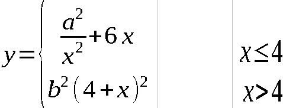

- [x] реализовал защиту от переполнения, установив числовой лимит в 1 млн. :+1: :tada: :octocat:
- [x] чтобы предотвратить вылеты при введение не чисел, применил технологию "try-catch". :sparkles: :rocket:
- [x] программа сама понимает что пользователь делит на ноль и предупреждает об этом. :camel: :metal:

 | 
--- | ---
 | 

